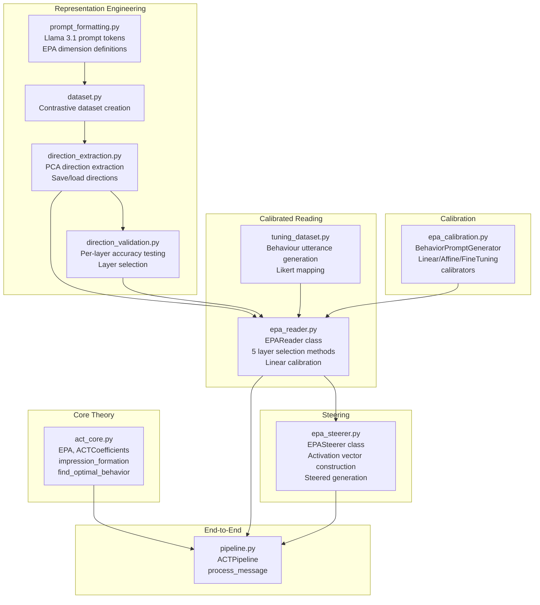

# Affective Intelligence: Steering LLM-Generated Responses Through Affect Control Theory and Representation Engineering

> **Purpose:** Preliminary project documentation for the PhD thesis *"Affective Intelligence: Steering and Evaluating Human-AI Interaction Through Socio-Emotional Models"*.
>
> **Author context:** This document is intended as handoff material for an agent that will draft thesis chapters. It describes the technical system, theoretical foundations, pipeline architecture, experimental methodology, and results.
>
> **Model:** `meta-llama/Llama-3.1-8B-Instruct`
>
> **Repository:** `representation-engineering` (fork of [andyzoujm/representation-engineering](https://github.com/andyzoujm/representation-engineering))

---

## 1. Problem Statement

Large language models generate responses without an explicit model of the socio-emotional dynamics of the conversation. When deployed in roles with defined social identities (e.g. a *counsellor* interacting with a *client*), their responses can violate the affective expectations that humans would intuitively maintain. There is no mechanism for an LLM to reason about how its response will shift the affective impressions of the interactants, or to choose a response whose affective tone minimises the "stress" of the interaction.

This project bridges two bodies of work to solve this problem:

1. **Affect Control Theory (ACT)** — a mathematical sociological model that predicts how people select behaviours to confirm culturally-shared affective meanings (Heise, 2007).
2. **Representation Engineering (RepE)** — a technique for reading and controlling high-level cognitive properties in neural network hidden states using linear probes and activation perturbation (Zou et al., 2023).

The resulting system reads the affective meaning of a user's message from the model's internal representations, uses ACT's impression-formation equations to compute the optimal affective response, and steers the model's generation by injecting calibrated activation vectors — all without fine-tuning or modifying the model's weights.

---

## 2. Theoretical Foundations

### 2.1 Affect Control Theory (ACT)

ACT (Heise, 2007) models social interaction through three universal affective dimensions:

| Dimension | Symbol | Semantic Range | Example Anchors |
|-----------|--------|----------------|-----------------|
| **Evaluation** | E | good ↔ bad | *kind* (+), *cruel* (−) |
| **Potency** | P | powerful ↔ weak | *authoritative* (+), *meek* (−) |
| **Activity** | A | active ↔ passive | *energetic* (+), *calm* (−) |

Every social identity (e.g. *doctor*, *friend*), behaviour (e.g. *console*, *threaten*), and emotion can be located as a point in this three-dimensional EPA space. These culturally-shared ratings are called **fundamental sentiments** and are measured through large-scale survey instruments.

#### Key ACT Concepts

- **Fundamental sentiments:** Stable, culturally-shared EPA profiles for identities and behaviours. Stored in ACT dictionaries (e.g. the 2010 US interaction survey with ~1,500 identities and ~900 behaviours).
- **Transient impressions:** The momentary EPA impressions created during an interaction event. After an actor performs a behaviour toward an object, transient impressions for all three elements are calculated via **impression formation equations** — a set of regression equations learned from human rating experiments.
- **Deflection:** The squared Euclidean distance between fundamental sentiments and transient impressions. Deflection quantifies the "stress" or "surprisingness" of an interaction. ACT's central principle is that people select behaviours to **minimise deflection** — i.e. to confirm the culturally-expected affective meanings of their identities.
- **Optimal behaviour:** Given the current transient impressions after a user's action, the optimal next behaviour is the one whose EPA, when fed through impression formation, pulls transient impressions closest to the fundamental sentiments. This is computed via numerical optimisation (L-BFGS-B with bounds).

#### Impression Formation Equations

Implemented from Heise's coefficient matrix approach. The input is a 9-element vector `[Ae, Ap, Aa, Be, Bp, Ba, Oe, Op, Oa]` representing actor, behaviour, and object EPAs. The coefficient matrix uses a binary encoding scheme (`Z` followed by 9 bits indicating which input elements are multiplied) to compute 9 output dimensions (post-event actor, behaviour, and object EPA impressions).

**Implementation:** [`act_core.py`](file:///c:/Users/Kyra/Documents/Repos/representation-engineering/examples/act_three/act_core.py) — `impression_formation()`, `calculate_deflection()`, `find_optimal_behavior()`, `get_response_epa_for_deflection_minimization()`.

### 2.2 Representation Engineering (RepE)

RepE (Zou et al., 2023; arXiv:2310.01405v4) treats the internal representations of large language models as a medium for reading and controlling high-level cognitive properties. Rather than interpreting individual neurons or circuits, RepE operates on population-level representation vectors.

#### Reading (Linear Probing)

A **contrastive dataset** is created where paired prompts differ only in a target property (e.g. "Pretend you're a *good* person…" vs. "Pretend you're a *bad* person…"). The same truncated assistant response is appended to both. PCA on the difference in last-token hidden states across layers extracts a **direction vector** per layer that maximally separates the two conditions.

To read a property from new text, one projects the last-token hidden state onto this direction vector:
```
score = dot(hidden_state[layer], direction[dim][layer])
```

#### Steering (Activation Addition)

To steer generation, the extracted direction vector is scaled and added to the model's hidden states during inference:
```
hidden_state'[layer] = hidden_state[layer] + coeff × sign × direction[dim][layer]
```

This shifts the model's behaviour along the target dimension without modifying any weights. The `coeff` controls the strength of the perturbation, and the `sign` ensures the correct direction (since PCA axes are unsigned).

**Critical implementation detail:** Direction vectors are **L2-normalised** before scaling so that the coefficient directly controls the perturbation magnitude (a coefficient of 1.0 adds a unit vector). Without normalisation, PCA directions of 4096-dimensional hidden states can have very large norms, making even small coefficients produce exaggerated effects.

---

## 3. System Architecture

The system is implemented as a modular Python package in [`examples/act_three/`](file:///c:/Users/Kyra/Documents/Repos/representation-engineering/examples/act_three/).

### 3.1 Pipeline Overview

```
┌──────────────────────────────────────────────────────────────────┐
│                         ACTPipeline                              │
│                                                                  │
│  User message ──► EPA Reader ──► ACT Deflection ──► EPA Steerer  │
│      "What the        │          Minimisation         │          │
│       hell?"     E=-1.2, P=1.5      │           E=+1.2, P=0.3   │
│                  A=+0.8         ┌───┘           A=-0.2           │
│                                 │                    │           │
│                    ┌────────────┘                    │           │
│                    ▼                                 ▼           │
│              impression_formation()         steer_generation()   │
│              find_optimal_behavior()       (inject activation    │
│                                             vectors into hidden  │
│                                             states)              │
│                                                  │               │
│                                                  ▼               │
│                                          Steered response        │
│                                     "I understand you're upset.  │
│                                      Let me help..."             │
└──────────────────────────────────────────────────────────────────┘
```

### 3.2 Module Architecture



### 3.3 File Inventory

| Module | Lines | Purpose |
|--------|-------|---------|
| [`act_core.py`](file:///c:/Users/Kyra/Documents/Repos/representation-engineering/examples/act_three/act_core.py) | 348 | ACT mathematics: EPA dataclass, impression formation, deflection, optimal behaviour |
| [`prompt_formatting.py`](file:///c:/Users/Kyra/Documents/Repos/representation-engineering/examples/act_three/prompt_formatting.py) | 145 | Llama 3.1 chat template, EPA dimension definitions, extraction templates |
| [`dataset.py`](file:///c:/Users/Kyra/Documents/Repos/representation-engineering/examples/act_three/dataset.py) | 107 | Contrastive dataset creation for direction extraction |
| [`direction_extraction.py`](file:///c:/Users/Kyra/Documents/Repos/representation-engineering/examples/act_three/direction_extraction.py) | 110 | PCA-based direction extraction + pickle save/load |
| [`direction_validation.py`](file:///c:/Users/Kyra/Documents/Repos/representation-engineering/examples/act_three/direction_validation.py) | 156 | Per-layer accuracy testing + spaced layer selection |
| [`tuning_dataset.py`](file:///c:/Users/Kyra/Documents/Repos/representation-engineering/examples/act_three/tuning_dataset.py) | 255 | LLM utterance generation, Likert mapping, stratified train/test splitting |
| [`epa_reader.py`](file:///c:/Users/Kyra/Documents/Repos/representation-engineering/examples/act_three/epa_reader.py) | 567 | Calibrated EPA reader with 5 layer-selection methods |
| [`epa_steerer.py`](file:///c:/Users/Kyra/Documents/Repos/representation-engineering/examples/act_three/epa_steerer.py) | 449 | EPA steering via activation perturbation |
| [`epa_calibration.py`](file:///c:/Users/Kyra/Documents/Repos/representation-engineering/examples/act_three/epa_calibration.py) | 728 | Calibration from raw readings to ACT-scale values |
| [`pipeline.py`](file:///c:/Users/Kyra/Documents/Repos/representation-engineering/examples/act_three/pipeline.py) | 269 | End-to-end orchestrator |
| [`visualization.py`](file:///c:/Users/Kyra/Documents/Repos/representation-engineering/examples/act_three/visualization.py) | 255 | t-SNE, LAT scan, per-token detection, EPA bar charts |

---

## 4. Methodology

### 4.1 Direction Extraction

**Goal:** Obtain a linear direction in the model's representation space for each of the three EPA dimensions.

**Procedure:**
1. **Create contrastive datasets** — for each dimension, generate 256 prompt pairs where the only semantic difference is the target adjective (e.g. "Pretend you're a *good* person making a statement" vs. "Pretend you're a *bad* person making a statement"). The same randomly-selected truncated assistant response is appended to both prompts.
2. **Run PCA** on the difference in last-token hidden states across all 31 transformer layers, yielding a direction vector per layer per dimension.
3. **Record direction signs** — since PCA axes are unsigned, determine the sign by checking which class (positive or negative) produces higher projections.

**Design decisions and rationale:**
- **Minimal extraction templates:** Single-sentence prompts following the RepE honesty pattern (Zou et al., 2023). This avoids confounding the target semantic contrast with irrelevant stylistic variation.
- **No "extremely":** Avoiding degree modifiers like "extremely" in target adjectives, as they can conflate intensity with the dimensional direction.
- **User-tag-only format:** No system prompt during extraction. The contrastive instruction is the entire user message. This prevents the system prompt from biasing the representation.
- **Output:** Saved as `epa_directions.pkl` containing a `RepReader` object per dimension (with `directions` and `direction_signs` dictionaries keyed by negative layer indices).

### 4.2 Direction Validation and Layer Selection

**Goal:** Identify which layers carry reliable EPA signal and select a subset for steering.

**Procedure:**
1. For each layer and dimension, compute binary classification accuracy: given a contrastive pair, can the direction correctly identify which prompt is the positive example?
2. Retain layers with accuracy ≥ 90% across all three dimensions.
3. Skip the last 2 qualifying layers (nearest the output) to avoid instability.
4. Select every 3rd remaining layer to prevent cascading effects during steering.

**Rationale:** Steering multiple adjacent layers with correlated directions can produce amplified, unpredictable effects. Spaced selection ensures each steering layer acts somewhat independently.

### 4.3 Calibrated EPA Reading

**Goal:** Convert raw representation projections into calibrated EPA values that are comparable to ACT dictionary ratings.

#### 4.3.1 Calibration Dataset Generation

1. **Select behaviours** from the ACT dictionary — 242 conversational behaviours (e.g. "console", "threaten", "apologize_to") with known EPA ratings.
2. **Generate utterances** — for each behaviour, use the LLM itself to generate 5 variant utterances that embody the behaviour (e.g. for "console": "It's okay, everything is going to be alright").
3. **Assign ground truth** — each utterance inherits the behaviour's EPA rating from the ACT dictionary.
4. **Stratified split** — k-means clustering on EPA vectors ensures train (90%) and test (10%) sets both cover the full EPA space without behaviour overlap.

#### 4.3.2 Layer Selection for Reading

Five methods are evaluated for combining per-layer readings into an aggregate EPA score:

| Method | Description | Sparsity |
|--------|-------------|----------|
| **Simple** | Uniform average of top-K layers by \|Spearman ρ\| | Dense |
| **Greedy** | Forward selection: iteratively add the layer+weight that most improves ρ | Moderate |
| **SFFS** | Sequential floating forward selection: greedy with backtracking | Moderate |
| **Ridge** | Non-negative Ridge regression (ElasticNet with l₁≈0) | Dense |
| **ElasticNet** | Non-negative ElasticNet with cross-validated l₁/l₂ ratio | Sparse |

**Evaluation protocol:**
1. **Phase 1:** Compute per-layer Spearman rank correlation between raw reading and ground truth EPA across the training set.
2. **Phase 2:** Apply each selection method to find optimal layer weights.
3. **Phase 3:** Fit linear calibration (slope + intercept) from the weighted raw score to the ACT-scale EPA value.
4. **Report** train and test set correlations for each method.

#### 4.3.3 Reading at Inference Time

For a new user message:
1. Format the text in the Llama 3.1 chat template (assistant position).
2. Run a single forward pass to extract hidden states from all layers.
3. For each dimension, compute the sign-corrected weighted average of projections onto the direction vectors at the selected layers.
4. Apply the linear calibration to produce a calibrated EPA value.

The complete read operation is encapsulated in `EPAReader.read_epa()`.

### 4.4 EPA Steering

**Goal:** Generate a response whose affective tone matches a target EPA computed by ACT.

**Procedure:**
1. **Read user EPA** — extract the EPA of the user's message using the calibrated reader (§4.3).
2. **ACT computation** — model the interaction: user (actor) performs behaviour toward agent (object). Compute post-event transient impressions via impression formation, then find the behaviour EPA that minimises total deflection. This is the **target EPA** for the agent's response.
3. **Build activation vectors** — for each selected steering layer, construct an activation vector as the sum of L2-normalised direction vectors scaled by the target EPA values:
   ```
   activation[layer] = Σ_dim (target[dim] × coeff × sign[dim][layer] × normalised_direction[dim][layer])
   ```
4. **Steered generation** — use the `rep-control` pipeline from the RepE library to inject the activation vectors into the model's forward pass during autoregressive generation.

**Steering coefficient tuning:** A base coefficient (default 2.0 per layer) controls the global strength of steering. This is tuned by generating responses at multiple coefficient values and measuring the resulting EPA shift via the calibrated reader.

> [!IMPORTANT]
> The steering operates on the same direction vectors used for reading, creating a closed loop: the directions that are most informative for measuring EPA are also the directions that most effectively shift EPA during generation. The `EPASteerer.from_reader()` factory method enforces this consistency by deriving the steering configuration directly from the reader's layer selection.

### 4.5 End-to-End Pipeline

The `ACTPipeline` class orchestrates the full loop:

```python
pipe = ACTPipeline(
    model_name="meta-llama/Llama-3.1-8B-Instruct",
    agent_identity=EPA(e=1.5, p=1.0, a=0.5),   # e.g. "counsellor"
    user_identity=EPA(e=1.0, p=0.5, a=0.3),     # e.g. "client"
)
pipe.load_model()
pipe.load_directions("epa_directions.pkl")
pipe.setup_reader("epa_reading_tuning_v2_results.json", method="ElasticNet")
pipe.setup_steerer(base_coeff=2.0)

# Single call: read → ACT compute → steer → generate
response = pipe.process_message("I can't believe you would say that to me!")
```

---

## 5. Key Technical Details

### 5.1 Layer Index Convention

Direction vectors are stored with **negative** layer indices (-1 through -31 for Llama-3.1-8B's 32 transformer layers). The `rep-control` pipeline also uses negative indices. Conversion to positive indices (`n_layers + negative_index`) is only needed when interacting with the low-level `WrappedReadingVecModel`.

### 5.2 RepReadingPipeline Constraint

The pipeline asserts that `len(rep_reader.directions) == len(hidden_layers)`. All layers from the RepReader must be passed — layer filtering happens *after* extraction, in the weighted averaging step.

### 5.3 L2 Normalisation

PCA direction vectors in 4096-dimensional space can have norms of ~5-20. Without normalisation, a steering coefficient of 1.0 would add a perturbation 5-20× larger than intended. L2 normalisation ensures the coefficient directly controls the perturbation magnitude.

### 5.4 Model and Hardware

- **Model:** `meta-llama/Llama-3.1-8B-Instruct` (8 billion parameters, 32 layers, hidden dim 4096)
- **Precision:** `torch.float16`
- **Hardware:** Single GPU with ≥16 GB VRAM (tested on NVIDIA A100 and RTX 4090)

---

## 6. Data Sources

### 6.1 ACT Dictionaries

| File | Contents |
|------|----------|
| `data/act/2010impressionformation.csv` | Impression formation coefficients (2010 US survey; Heise, 2007/2010) |
| `data/act/MTurkInteract_Behaviors.csv` | Behaviour EPA ratings from Amazon Mechanical Turk surveys (~900 behaviours) |

### 6.2 Contrastive Training Data

| File | Contents |
|------|----------|
| `data/act/user_inputs.json` | Diverse user-input prompts used as context for contrastive pairs |
| `data/act/all_truncated_outputs.json` | Truncated assistant responses appended to both positive and negative prompts |

### 6.3 Generated Artefacts

| File | Format | Contents |
|------|--------|----------|
| `epa_directions.pkl` | Pickle | PCA direction vectors per layer per EPA dimension |
| `epa_tuning_dataset.json` | JSON | ~1,200 LLM-generated utterances with ground-truth EPA from ACT dictionary |
| `epa_reading_tuning_v2_results.json` | JSON | Full tuning results: phase 1 correlations, 5 method results, calibration coefficients |

---

## 7. Preliminary Results

### 7.1 Reading Quality

Baseline per-dimension Spearman rank correlations (representation reading, uniform average over all layers):

| Dimension | Spearman ρ (baseline) |
|-----------|----------------------|
| Evaluation | +0.746 |
| Potency | +0.403 |
| Activity | +0.516 |

The layer-selection methods (ElasticNet, SFFS, etc.) improve upon these baselines by selecting informative layers and down-weighting noisy ones. Exact improved figures are stored in the tuning results file.

### 7.2 Steering Effectiveness

Qualitative evaluation shows that EPA steering produces meaningful tone shifts in generated responses:
- Increasing Evaluation produces more positive, prosocial language.
- Increasing Potency produces more assertive, authoritative language.
- Increasing Activity produces more energetic, animated language.
- The effect is approximately monotonic in the steering coefficient.

### 7.3 Observations and Limitations

- **Evaluation (E) is the most readable dimension,** consistently showing the highest correlations across layers. This aligns with the general observation that moral valence is a salient dimension in LLM representations.
- **Potency (P) is the hardest dimension to read,** suggesting that power/dominance may be a more contextual and distributed property in model representations.
- **Steering can degrade coherence at extreme coefficients** (|coeff| > 4). A sigmoid-like tapering function constrains the effective steering magnitude.
- **System prompt interaction:** The presence or absence of a system prompt during generation affects how steering manifests. The current design uses a minimal system prompt during generation but none during direction extraction.

---

## 8. Related Work and Positioning

This project occupies a unique intersection of three research areas:

1. **Affect Control Theory in computing.** ACT has been applied to virtual agents (Hoey et al., 2008; Schröder et al., 2012) and sentiment analysis (Amini et al., 2019), but never to directly controlling LLM internal representations. Previous work used ACT to *select* pre-written responses or modify surface features; this project operates on the model's latent space.

2. **Representation Engineering.** RepE (Zou et al., 2023) demonstrated reading and control of properties like honesty, harmlessness, and happiness. This project extends RepE to the three-dimensional EPA space and introduces ACT-informed target computation. It is the first application of RepE where the reading target is derived from a formal sociological theory rather than binary labels.

3. **Affective computing and LLMs.** Prior work on emotional LLMs focuses on emotion classification in output text or prompt-based emotion elicitation. This project is distinct in that it (a) reads affective meaning from internal representations rather than output text, (b) uses a mathematically grounded theory to determine the *appropriate* affective response rather than arbitrary emotional targets, and (c) controls generation through activation-space perturbation rather than prompt engineering or fine-tuning.

---

## 9. Thesis Contribution

This project provides the central contribution of the thesis: **a complete, theoretically-grounded system for reading and controlling the socio-emotional properties of LLM-generated responses through internal representation manipulation, guided by Affect Control Theory.**

Key contributions:

1. **Extending RepE to multi-dimensional affective space.** Demonstrating that the three dimensions of EPA (Evaluation, Potency, Activity) can be independently read and steered in LLM hidden states.

2. **Bridging sociological theory and neural network internals.** Using ACT's impression-formation equations to compute the *theoretically optimal* affective response, then using RepE to realise that response in the model's generation.

3. **A calibration and tuning methodology.** A systematic pipeline for calibrating raw representation readings against empirically validated ACT dictionary values, with five layer-selection methods and linear calibration.

4. **An end-to-end system.** A deployable pipeline (`ACTPipeline`) that processes user messages and generates responses with affect-appropriate steering in a single call.

---

## 10. References

- Heise, D. R. (2007). *Expressive Order: Confirming Sentiments in Social Actions.* Springer. https://doi.org/10.1007/978-0-387-38179-4
- Zou, A., Phan, L., Chen, S., Campbell, J., Guo, P., Ren, R., Pan, A., Yin, X., Mazeika, M., Dombrowski, A.-K., Goel, S., Li, N., Byun, M. J., Wang, Z., Mallen, A., Basart, S., Koyejo, S., Song, D., Fredrikson, M., Kolter, J. Z., & Hendrycks, D. (2023). Representation Engineering: A Top-Down Approach to AI Transparency. *arXiv preprint,* arXiv:2310.01405v4. https://arxiv.org/abs/2310.01405
- Hoey, J., Schröder, T., & Alhothali, A. (2013). Affect control processes: Intelligent affective interaction using a partially observable Markov decision process. *Artificial Intelligence,* 230, 134–172.
- Amini, F., Hu, R., & Lohr, M. (2019). Using affect control theory to analyze sentiment in text. *Proceedings of the International Conference on Social Informatics.*
- Schröder, T., Hoey, J., & Rogers, K. B. (2016). Modelling dynamic identities and uncertainty in social interactions: Bayesian affect control theory. *American Sociological Review,* 81(4), 828–855.

---

## Appendix A: Replication Guide

```bash
# Clone the repository
git clone https://github.com/<user>/representation-engineering.git
cd representation-engineering

# Install dependencies
pip install -e .
pip install scipy scikit-learn seaborn tqdm

# Python usage
from examples.act_three import ACTPipeline, EPA

pipe = ACTPipeline(
    agent_identity=EPA(e=1.5, p=1.0, a=0.5),
    user_identity=EPA(e=1.0, p=0.5, a=0.3),
)
pipe.load_model()                                      # Downloads Llama-3.1-8B-Instruct
pipe.load_directions("epa_directions.pkl")              # Pre-extracted EPA directions
pipe.setup_reader("epa_reading_tuning_v2_results.json") # Calibrated reader config
pipe.setup_steerer(base_coeff=2.0)                      # Steering configuration

response = pipe.process_message("Hello, how are you today?")
print(response)
```

## Appendix B: Glossary

| Term | Definition |
|------|-----------|
| **EPA** | Evaluation, Potency, Activity — the three universal affective dimensions in ACT |
| **Fundamental sentiment** | The culturally-shared EPA profile of an identity, behaviour, or modifier |
| **Transient impression** | The momentary EPA impression created during a specific interaction event |
| **Deflection** | Squared Euclidean distance between fundamental and transient EPA; measures interaction "stress" |
| **Impression formation** | ACT's regression equations predicting transient impressions from actor, behaviour, and object EPAs |
| **Direction vector** | A linear direction in the LLM's hidden-state space that corresponds to an EPA dimension, extracted via PCA on contrastive prompt pairs |
| **Steering coefficient** | Scalar multiplier controlling the magnitude of the activation perturbation along a direction vector |
| **RepReader** | An object from the `repe` library storing PCA direction vectors and signs for each layer |
| **Spearman ρ** | Rank correlation coefficient used to evaluate how well raw readings predict ground-truth EPA values |
| **L2 normalisation** | Scaling direction vectors to unit norm so that steering coefficients have predictable magnitude effects |
